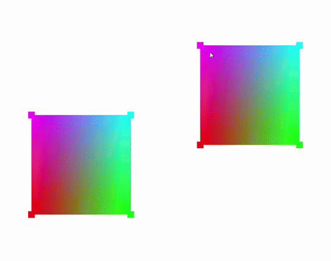

#### Grégori Fernandes de Lima

# Computação Gráfica - 2025/1

Repositório de exemplos de códigos em C++ utilizando OpenGL moderna (3.3+) criado para a Atividade Acadêmica Computação Gráfica do curso de graduação em Ciência da Computação - modalidade híbrida - da Unisinos.

## Tarefas Entregues
- **09/03/2025**
    -> DESAFIO MÓDULO 1: Tarefa - Criando o ambiente de Programação de cenas 3D

- **28/04/2025**
  -> DESAFIO MÓDULO 2: Instanciando objetos na cena 3D

- **20/05/2025**
  -> DESAFIO MÓDULO 3: Adicionando texturas

- **31/05/2025**
  -> DESAFIO MÓDULO 4: Adicionando iluminação (modelo Phong)
  
---

<ins>Grégori Fernandes de Lima</ins>

---

### - Tarefa 1: Criando o ambiente de Programação de cenas 3D

---

### - Tarefa 2: Instanciando objetos na cena 3D

---

### - Tarefa 3: Adicionando Texturas

---

### - Tarefa 4: Adicionando Iluminação

---
executando o projeto:
Na pasta build:
> cmake --build .
> 
> ./Hello3d.exe