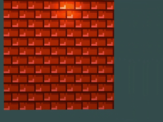
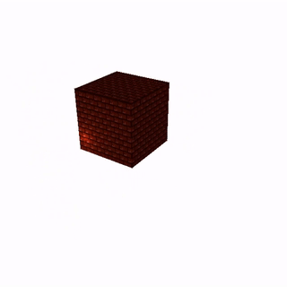

#### Grégori Fernandes de Lima

### - Tarefa 1: Criando o ambiente de Programação de cenas 3D

---

### - Tarefa 2: Instanciando objetos na cena 3D

---

### - Tarefa 3: Adicionando Texturas

---

### - Tarefa 4: Adicionando Iluminação

---

### - Tarefa 5: Adicionando uma câmera em primeira pessoa

---

### - Tarefa 6: Adicionando uma câmera em primeira pessoa

